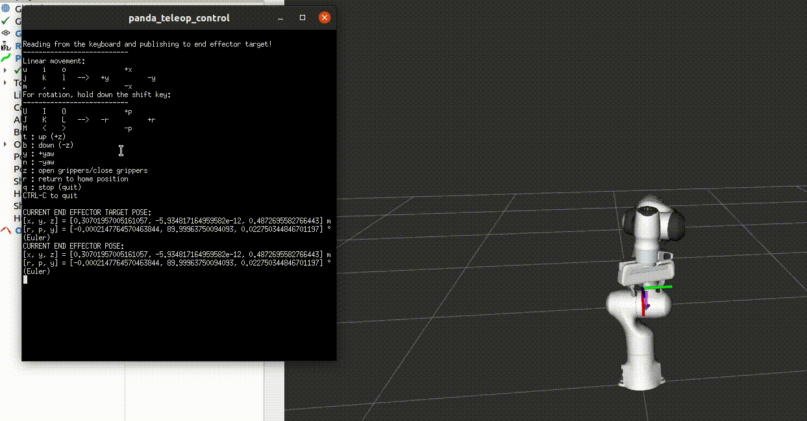

# Teleop Control for Franka Emika Panda Robot in ROS2

This package provides a teleoperation interface to control the Franka Emika Panda robot. This repository is cloned automatically into your workspace upon importing the repositories listed in the [`workspace.repos`](https://github.com/nicholaspalomo/panda_ros2_gazebo/blob/master/workspace.repos) of the accompanying [`panda_ros2_gazebo`](https://github.com/nicholaspalomo/panda_ros2_gazebo/) repository. You should first consult the installation instructions provided [there](https://github.com/nicholaspalomo/panda_ros2_gazebo/#installation). Please also make sure to install xterm on your machine.



To launch this node, in a fresh terminal, source your workspace:
```
$ source install/setup.bash
```
and launch the teleop node with:
```
$ ros2 launch panda_teleop panda_teleop_control.launch.py mode:=<keyboard operation mode>
```
where `<keyboard operation mode>` is either:
- `teleop` if you wish to move the end effector using keystroke mappings from the keyboard, or
- `setpoint` if you wish to specify an array of values denoting the end effector target pose directly.

Upon launching this node, an xterm console will appear. Press `ENTER`/`RETURN` to make the cursor and help text appear.

The table below shows the [commands you can send to move the end effector](https://github.com/nicholaspalomo/panda_teleop/blob/main/panda_teleop/panda_teleop_control.py#L118) in Cartesian space.

| Key | Direction |
| --- | ---       | 
| `u` | +x, +y    |
| `i` | +x        |
| `o` | +x, -y    |
| `j` |     +y    |
| `l` |     -y    |
| `m` | -x, +y    |
| `,` | -x        |
| `.` | -x, -y    |
| `t` | +z        |
| `b` | -z        |
| `U` | -r, -p    |
| `I` | +r        |
| `O` | +r, -p    |
| `J` |     +p    |
| `L` |     -p    |
| `M` | -r, +p    |
| `<` | -r        |
| `>` | -r, -p    |
| `y` | +yaw      |
| `n` | -yaw      |
| `z` | open/close grippers      |
| `r` | return to HOME position  |
| `q` | quit teleop control AND return to HOME position  |

Notes:
 - Euler angle representation used for the end effector orientation about the principal axes
 - One press of each key causes the end effector to translate/rotate by 1 cm/1° in the desired direction.
 - The workspace for the end effector is limited to the [following dimensions](https://github.com/nicholaspalomo/panda_teleop/blob/main/panda_teleop/panda_teleop_control.py#L182):

| Direction | Limits | Units |
| ---       | ---    | ---   |
| x         | [0, 1] | m     |
| y         | [-1, 1]| m     |
| z         | [0, 1] | m     |
| roll      | [-90, 90] | °     |
| pitch     | [-90, 90] | °     |
| yaw       | [-90, 90] | °     |